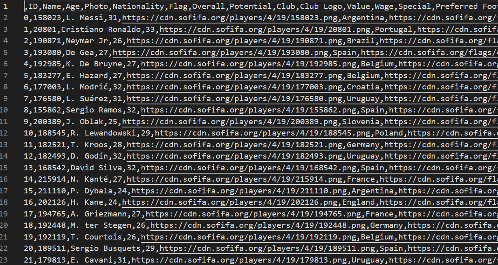
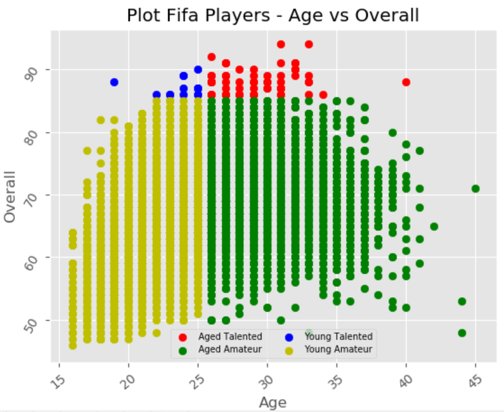

# Plotting FIFA Players Data Set from *Kaggle.com* using *Matplotlib* package
### Kaggle
Kaggle is an online community of data scientists and machine learners, owned by Google LLC. Kaggle allows users to find and publish data sets, explore and build models in a web-based data-science environment, work with other data scientists and machine learning engineers, and enter competitions to solve data science challenges.

This repo will try to plot a certain data from all fifa players data set available on kaggle. The plotted data are the players' age and overall skill. The purpose is trying to analyse how the player's age related to the player's skill.
1. Create kaggle account. Then create API from https://www.kaggle.com/<yourUsername>/account to get the "username" and "key"

2. Install kaggle:
    ```bash
    $ py -m pip install kaggle 
    ```

3. Create new directory:
    ```bash
    $ mkdir ~/.<DirectoryName>
    ```

4. Download FIFA data set from *https://www.kaggle.com/karangadiya/fifa19* set via terminal:
    ```bash
    $ kaggle <DestinationFolderName> downdload -d <username>/<datasetName>
    ```
    or to directly download it unzipped:
    ```bash
    $ kaggle <DestinationFolderName> downdload -d <username>/<datasetName> --unzip --force
    ```
    or if it doesn't work, just download it manually from the link above. A screenshot of how the fifa data set should look like in csv format:
    
    Save the data set in the same folder and name it *'data.csv'*.

5. Clone this repo and *run* the program. 

6. A screenshot of how the output graphic will look like:
    

### **_Enjoy!_**

#

#### Albertus Rianto Wibisono ✉ _albertusrian95@gmail.com_

[Instagram](https://www.instagram.com/rian__wibisono) | 
[LinkedIn](https://www.linkedin.com/in/albertusrian95/) |
[GitHub](https://www.github.com/RiantoWibisono)
